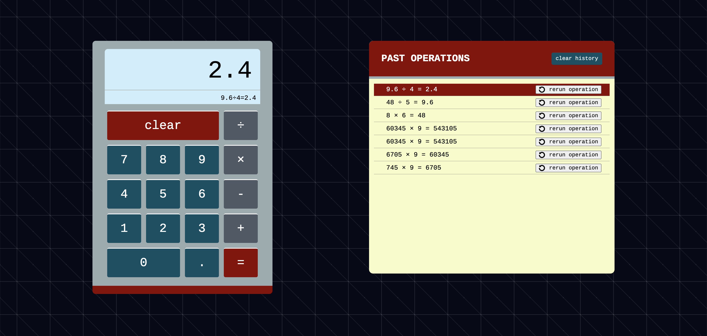

# Server-side calculator

## Description

This project originated as the second weekend assignment at Prime Digital Academy. The base goals (required features) were to:

* create a basic client side interface that accepts two numerical values, one of the four basic arithmetic operations, and sends this data to a server to conduct the calculation.
* create a clear button to clear inputs
* create a log of all past operations, updated with each new calculation.

Stretch goals in the project included:

* convert to a real-life calculator interface (i.e., buttons for each number, updating display, etc.)
* error detection - prevent calls to server if inputs were not filled
* clear history button - implementing a DELETE request to clear server cache of past operations
* option for users to click an entry in the history list to re-run that operation.

In addition to these base and stretch goals, I added the following:

* small display showing the entire current operation
* support for repeated operations
    * clicking equal multiple times repeats the most recent operation(1+1 => +1 => +1, etc.)
    * past result automatically saves as the first input of the next operation
* extensive CSS stylings to improve intuitive responsiveness
    * all buttons responsive to :hover and :active
    * media queries to adjust layout according to screen size

To see this app deployed, visit https://retro-calculator.herokuapp.com/

## Built With

* Node.js
* express
* jquery
* nodemon (dev dependency)

## Acknowledgement

Thanks to Prime Digital Academy who equipped and helped me to make this application.

## Support

If you have suggestions or issues, please email me at [pdebuque@gmail.com](pdebuque@gmail.com).